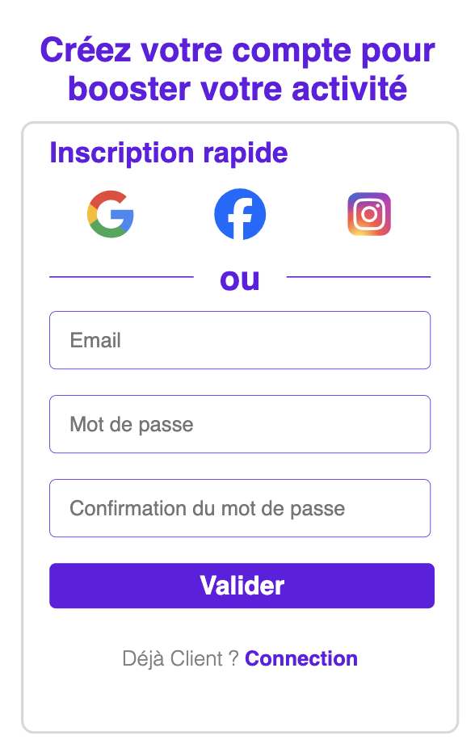

# Backend User Authentication

[](LICENSE)

This is a robust backend built to handle user authentication for a React application. It supports multiple login methods including email-password authentication, as well as third-party integrations with Google, Facebook, and Instagram. The project uses MySQL as its database and adheres to professional development practices.   

## Description  

The objective of this project is to provide a secure, scalable, and efficient authentication system for modern web applications. The backend is designed to manage user accounts, validate credentials, and securely handle third-party login processes. Key features include:  

- Email-password registration and login.
- Social login via Google, Facebook, and Instagram.
- Secure handling of sensitive information using a .env file.
- MySQL database integration with unique email enforcement.
- Modular and professional backend structure.  



The backend ensures data integrity and security by employing industry standards for hashing passwords, validating user inputs, and managing tokens. It is structured for scalability and extensibility, allowing for easy integration into existing projects or new systems.  

## Table of Contents

- [Getting Started](#Getting-Started)
- [Environment Variables](#Environment-Variables)
- [Database Setup](#Database-Setup)
- [Launch Application](#Launch-Application)
- [Contributing](#Contributing)
- [License](#License)  

## Getting Started   

To set up the project locally, follow these steps:  

```bash
git clone https://github.com/HaDock404/back-web-marketing.git
cd back-web-marketing
npm install
```  

## Launch Application  

Ensure you create a .env file in the project root directory with the following structure:  

```env
DB_HOST=your_database_host
DB_USER=your_database_user
DB_PASSWORD=your_database_password
DB_NAME=your_database_name
SECRET_KEY=your_secret_key
GOOGLE_CLIENT_ID=your_google_client_id
GOOGLE_CLIENT_SECRET=your_google_client_secret
FACEBOOK_APP_ID=your_facebook_app_id
FACEBOOK_APP_SECRET=your_facebook_app_secret
INSTAGRAM_CLIENT_ID=your_instagram_client_id
INSTAGRAM_CLIENT_SECRET=your_instagram_client_secret
```  

Replace placeholders with your actual configuration values.  

## Launch Application  

Create and configure the MySQL database. Run the following commands to set up the database schema:  

```sql
CREATE DATABASE authentication_api;
USE authentication_api;

-- Example table for users
CREATE TABLE users (
    id INT AUTO_INCREMENT PRIMARY KEY,
    email VARCHAR(255) UNIQUE NOT NULL,
    password_hash VARCHAR(255) NOT NULL,
    provider ENUM('email', 'google', 'facebook', 'instagram') NOT NULL,
    created_at TIMESTAMP DEFAULT CURRENT_TIMESTAMP
);
```

## Launch Application   

Run the application using the following commands:  

```bash
node src/app.js
```  

The backend will be available at http://localhost:3001/ by default.  

## Contributing

Pull requests are welcome. For major changes, please open an issue first
to discuss what you would like to change.

Please make sure to update tests as appropriate.

## License  

This project is licensed under the MIT License - see the [LICENSE](./LICENSE) file for details.